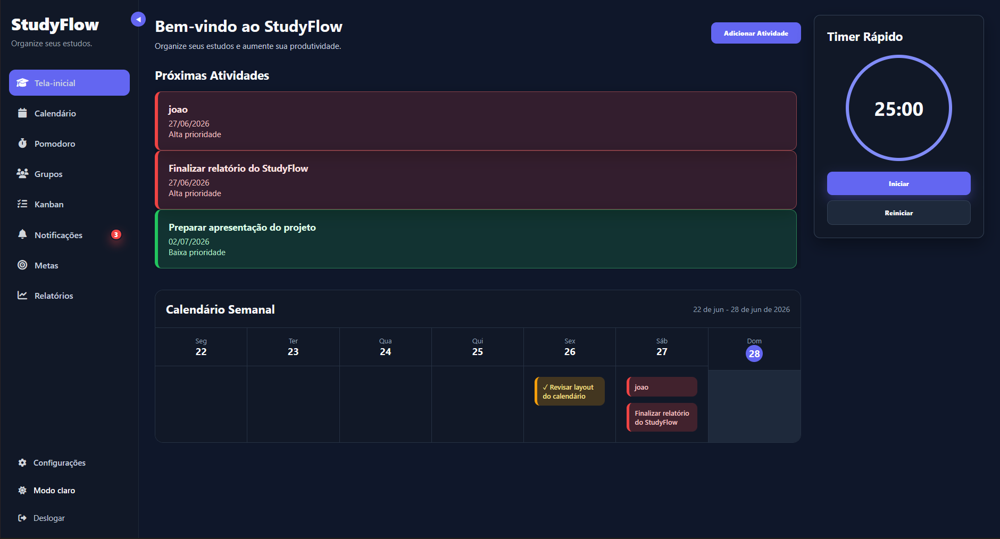
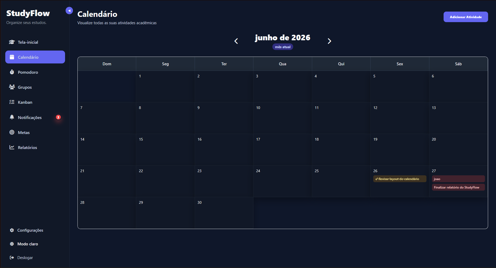
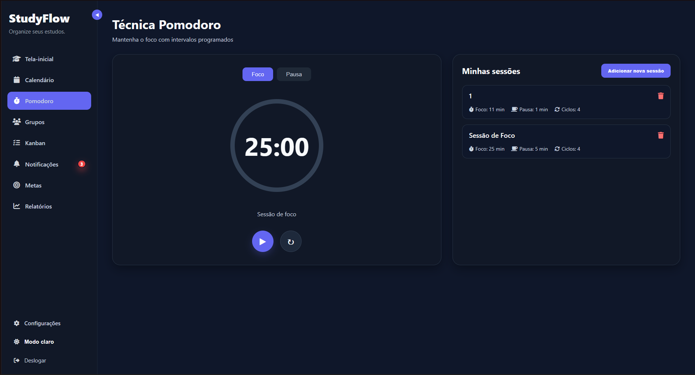
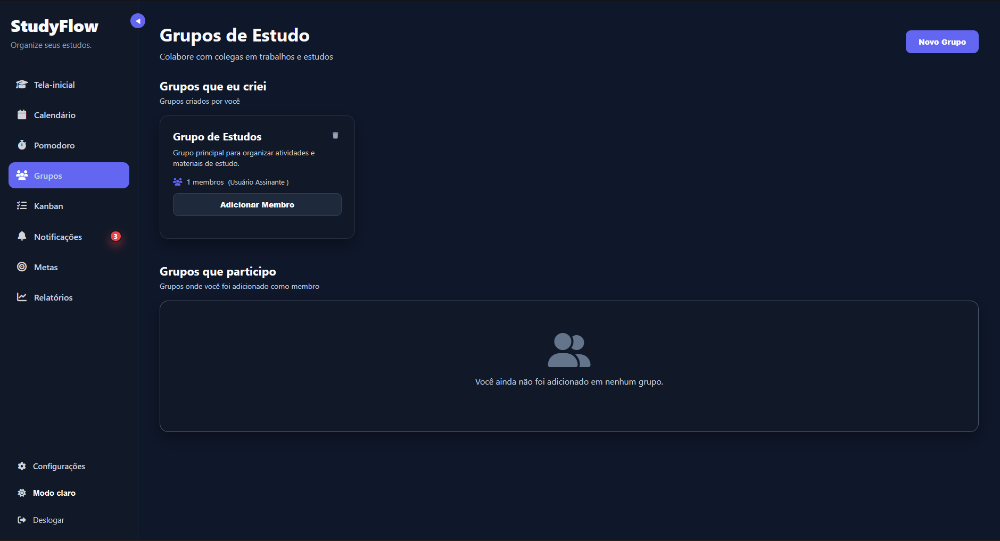
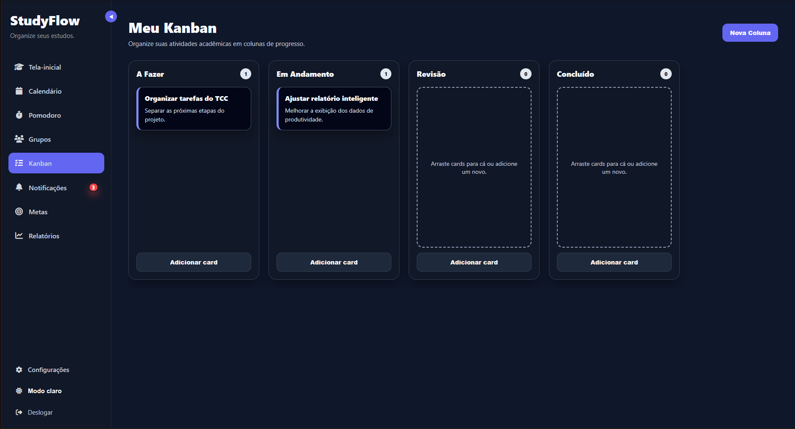
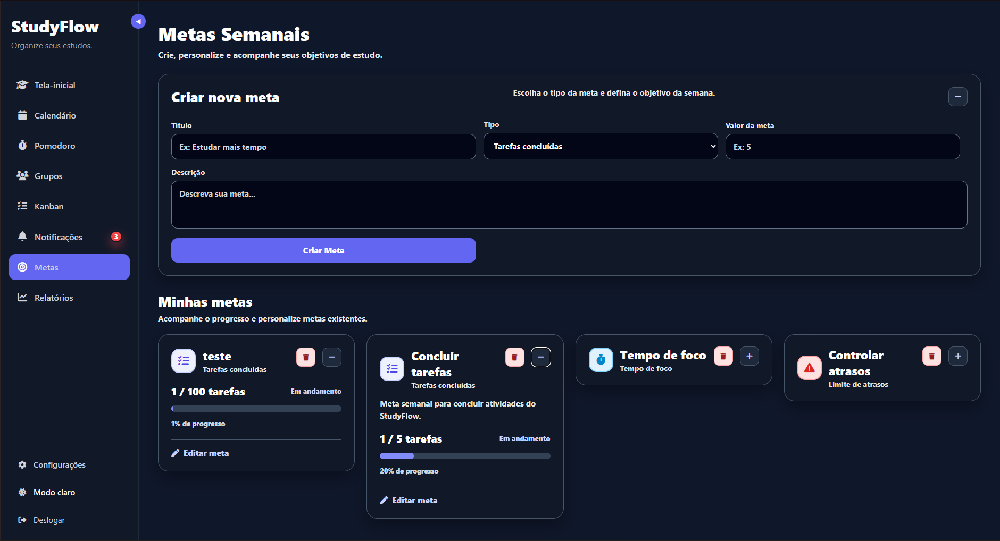
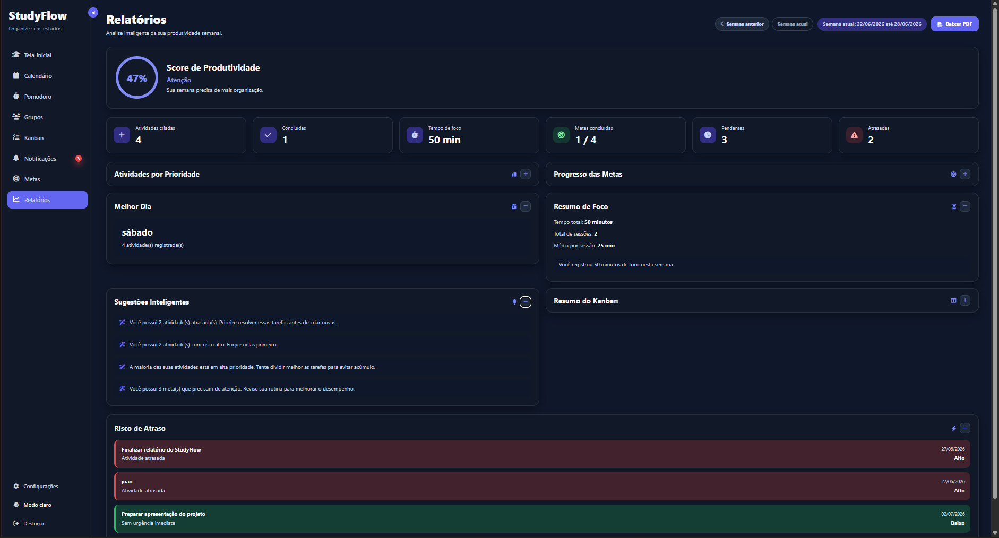
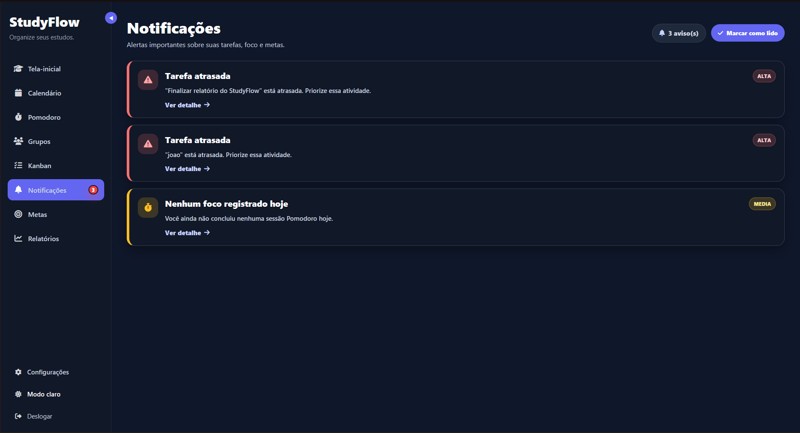
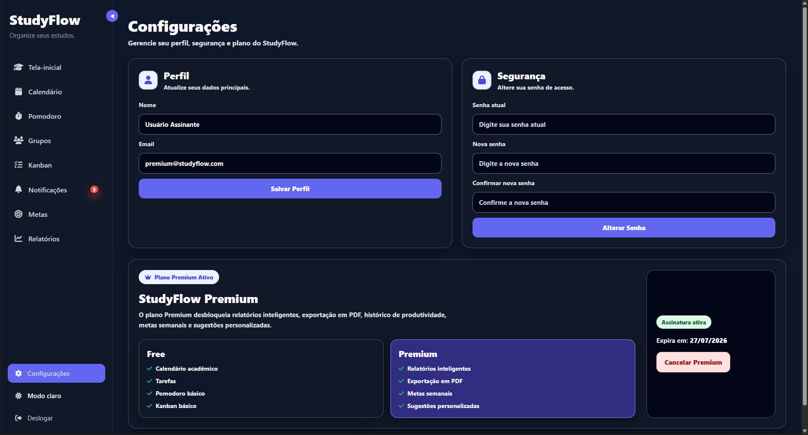

# StudyFlow

O **StudyFlow** é uma plataforma web desenvolvida para ajudar estudantes a organizarem melhor sua rotina acadêmica. O sistema reúne, em um só lugar, ferramentas para controle de tarefas, calendário, grupos de estudo, Kanban, Pomodoro, metas semanais, notificações internas e relatórios inteligentes de produtividade.

O projeto foi desenvolvido como uma solução prática para estudantes que precisam acompanhar prazos, manter o foco nos estudos e visualizar sua evolução semanal de forma simples e organizada.

## Índice

* [Sobre o projeto](#sobre-o-projeto)
* [Funcionalidades](#funcionalidades)
* [Prints do sistema](#prints-do-sistema)
* [Tecnologias utilizadas](#tecnologias-utilizadas)
* [Estrutura do projeto](#estrutura-do-projeto)
* [Como rodar o projeto](#como-rodar-o-projeto)
* [Banco de dados](#banco-de-dados)
* [Usuários de teste](#usuários-de-teste)
* [Status do projeto](#status-do-projeto)

## Sobre o projeto

O StudyFlow tem como objetivo centralizar a organização acadêmica do estudante. A plataforma permite cadastrar atividades, visualizar tarefas no calendário, organizar grupos, controlar sessões de foco com Pomodoro e acompanhar a produtividade por meio de relatórios semanais.

Além das funcionalidades tradicionais de organização, o sistema utiliza **Python** para analisar dados do usuário e gerar relatórios inteligentes, incluindo sugestões de produtividade e exportação em PDF.

## Funcionalidades

### Autenticação de usuários

* Cadastro de usuário
* Login e logout
* Autenticação com JWT
* Proteção de rotas privadas
* Controle de acesso por usuário

### Página inicial

* Visualização de próximas atividades
* Resumo das tarefas pendentes
* Acesso rápido às principais áreas do sistema
* Timer rápido de foco

### Calendário acadêmico

* Visualização mensal das atividades
* Navegação entre meses
* Cadastro de atividades por data
* Edição de atividades
* Marcação de atividades concluídas
* Destaque do mês atual

### Tarefas

* Criação de tarefas acadêmicas
* Edição de título, descrição, prioridade e data
* Conclusão de tarefas
* Identificação de tarefas atrasadas
* Registro de conclusão para relatórios

### Pomodoro

* Timer de foco
* Registro de sessões concluídas
* Controle de tempo estudado
* Dados usados nos relatórios semanais

### Grupos de estudo

* Criação de grupos por disciplina
* Organização por descrição e prioridade
* Visualização de grupos cadastrados
* Estrutura para membros de grupos

### Kanban

* Organização visual de atividades
* Quadros, colunas e cards
* Colunas como “A Fazer”, “Em Andamento”, “Revisão” e “Concluído”
* Acompanhamento do progresso das tarefas

### Metas semanais

* Criação de metas personalizadas
* Metas por tarefas concluídas
* Metas por tempo de foco
* Metas por limite de atrasos
* Acompanhamento de progresso semanal

### Relatórios inteligentes

* Análise semanal de produtividade
* Total de tarefas criadas
* Total de tarefas concluídas
* Atividades atrasadas
* Tempo de foco
* Análise do Kanban
* Análise das metas
* Sugestões inteligentes geradas com Python

### Exportação em PDF

* Geração de relatório semanal em PDF
* Resumo de produtividade
* Dados de foco, tarefas, metas e Kanban
* Arquivo pronto para download

### Notificações internas

* Avisos de tarefas atrasadas
* Avisos de tarefas vencendo hoje
* Avisos de tarefas vencendo amanhã
* Alertas de foco diário
* Notificações relacionadas às metas
* Contador de notificações na sidebar
* Opção de marcar notificações como lidas

### Plano Premium

* Controle de plano Free e Premium
* Bloqueio de recursos exclusivos
* Relatórios inteligentes disponíveis para usuários Premium
* Exportação em PDF protegida por assinatura

## Prints do sistema

### Tela inicial



### Calendário



### Pomodoro



### Grupos



### Kanban



### Metas



### Relatórios



### Notificações



### Configurações



## Tecnologias utilizadas

### Front-end

* HTML
* CSS
* JavaScript
* EJS
* Font Awesome

### Back-end

* Node.js
* Express.js
* MySQL2
* JWT
* Bcrypt
* Cookie-parser
* Dotenv

### Banco de dados

* MySQL

### Python

* Python
* mysql-connector-python
* ReportLab

### Ferramentas

* Visual Studio Code
* Git
* GitHub
* MySQL Workbench

## Estrutura do projeto

```txt
StudyFlow/
├── client/
│   ├── public/
│   │   ├── css/
│   │   ├── js/
│   │   └── img/
│   └── views/
│       ├── auth/
│       ├── partials/
│       └── usuarios/
├── data/
│   └── banco.sql
├── docs/
│   └── prints/
├── python/
│   ├── gerar_pdf_semanal.py
│   └── relatorio_semanal.py
├── server/
│   ├── config/
│   ├── controllers/
│   ├── middlewares/
│   ├── models/
│   ├── routes/
│   ├── services/
│   └── server.js
├── .env
├── package.json
└── README.md
```

## Como rodar o projeto

### 1. Clone o repositório

```bash
git clone https://github.com/SeiLa712/studyflow.git
```

### 2. Acesse a pasta do projeto

```bash
cd studyflow/StudyFlow
```

### 3. Instale as dependências do Node.js

```bash
npm install
```

### 4. Instale as dependências do Python

```bash
pip install mysql-connector-python reportlab
```

### 5. Configure o arquivo `.env`

Crie um arquivo chamado `.env` na raiz do projeto:

```env
DB_HOST=localhost
DB_USER=root
DB_PASSWORD=sua_senha
DB_NAME=StudyFlow
JWT_SECRET=sua_chave_secreta
PYTHON_CMD=python
PORT=5000
```

### 6. Crie o banco de dados

Importe o arquivo SQL localizado em:

```txt
data/banco.sql
```

Você pode executar pelo MySQL Workbench ou pelo terminal do MySQL.

### 7. Inicie o servidor

```bash
npm run server
```

### 8. Acesse no navegador

```txt
http://localhost:5000
```

## Banco de dados

O banco de dados utiliza **MySQL** e contém tabelas para:

* Usuários
* Tarefas
* Grupos
* Membros de grupos
* Kanbans
* Colunas do Kanban
* Cards do Kanban
* Sessões Pomodoro
* Metas semanais

O arquivo principal do banco está em:

```txt
data/banco.sql
```

## Usuários de teste

### Usuário Premium

```txt
Email: premium@studyflow.com
Senha: 123456
```

### Usuário Free

```txt
Email: free@studyflow.com
Senha: 123456
```

## Objetivo do projeto

O objetivo do StudyFlow é oferecer uma ferramenta simples, visual e prática para melhorar a organização acadêmica dos estudantes. A plataforma centraliza tarefas, prazos, métodos de foco, metas e relatórios de desempenho, ajudando o usuário a entender melhor sua rotina e tomar decisões mais organizadas durante os estudos.

## Status do projeto

O projeto está em desenvolvimento e já possui as principais funcionalidades integradas, incluindo autenticação, calendário, tarefas, Pomodoro, grupos, Kanban, metas, notificações, relatórios inteligentes com Python e geração de PDF.

## Autor

Desenvolvido por **João Pedro, André, Miguel Pacheco, Fabricio e Pedro Henrique** como projeto acadêmico/TCC.
